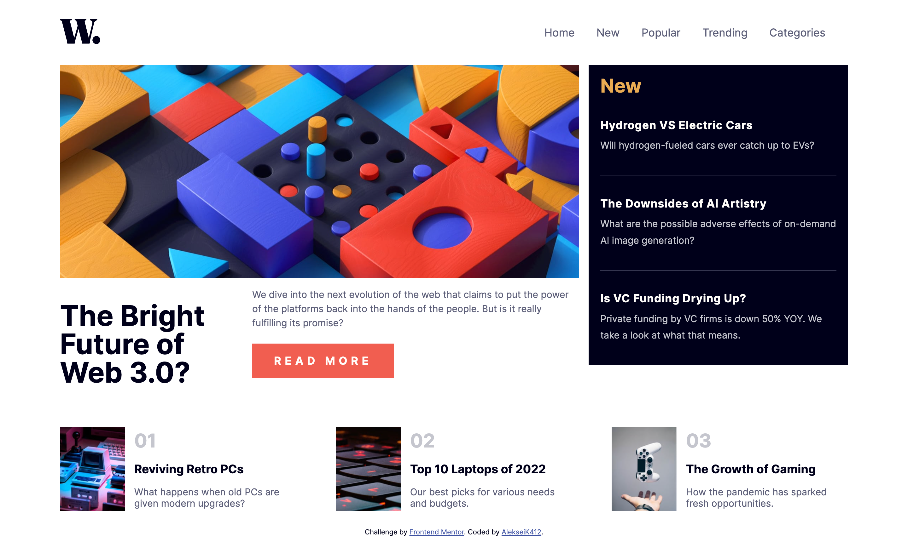
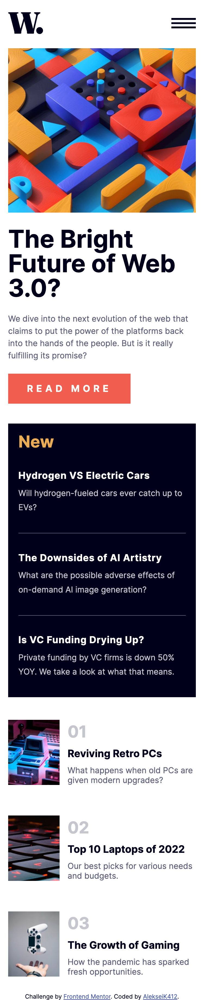

# Frontend Mentor - News homepage solution

This is a solution to the [News homepage challenge on Frontend Mentor](https://www.frontendmentor.io/challenges/news-homepage-H6SWTa1MFl).

## Table of contents

- [Overview](#overview)
  - [The challenge](#the-challenge)
  - [Screenshot](#screenshot)
  - [Links](#links)
- [My process](#my-process)
  - [Built with](#built-with)
  - [What I learned](#what-i-learned)
- [Author](#author)

## Overview

### The challenge

Users should be able to:

- View the optimal layout for the interface depending on their device's screen size
- See hover and focus states for all interactive elements on the page
- **Bonus**: Toggle the mobile menu (requires some JavaScript)

### Screenshot




### Links

- [Live Site](https://kalexei-news-homepage.netlify.app/)
- [Solution](https://github.com/kalexei/news-homepage/)

## My process

### Built with

- Semantic HTML5 markup
- CSS custom properties
- Flexbox
- CSS Grid
- Mobile-first workflow

### What I learned

I don't think I learned anything new while making this, though I practiced some CSS Grid, which helped me understand how it works a little better.

Here is the Javascript for the sidebar menu:

```js
// Grab all the necessary elements
const menuButton = document.querySelectorAll(".menu-button");
const navbar = document.querySelector(".navbar");
// This is a div that is positioned absolute and covers the whole page, except for the menu bar, that is by default not displayed 
const blurOverlay = document.querySelector(".blur");

// There is two menuButton's, one that opens the menu and one that closes it
menuButton.forEach(btn => {
// Here I go through them and add an Event Listener for "click"
  btn.addEventListener("click", () => {
    // I check if the type of button clicked was the one that closes, or the one that opens the menu bar
    if (btn.classList.contains("open")) {
      // If it is the one that opens the menu, I add a class to the menu bar that makes it show up and also make the blur div visible
      navbar.classList.add("open");
      blurOverlay.classList.add("visible");
    } else if (btn.classList.contains("close")) {
      // If it is the one that closes the menu, I remove the class from the menu bar that makes it show up and stop displaying the blur div
      navbar.classList.remove("open");
      blurOverlay.classList.remove("visible");
    }
  });
});
```

## Author

- Frontend Mentor - [@AlekseiK412](https://www.frontendmentor.io/profile/AlekseiK412)
- Twitter - [@\_kalexei\_](https://www.twitter.com/_kalexei_)
- Github - [@kalexei](https://github.com/kalexei)
